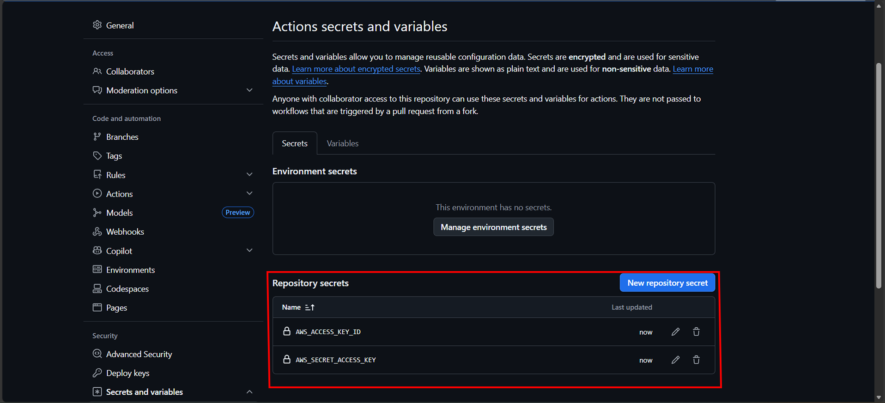
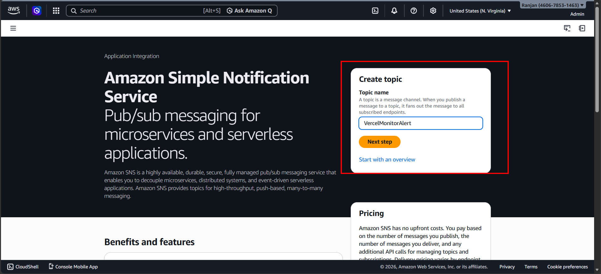
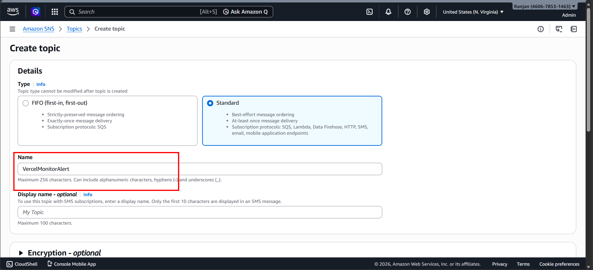
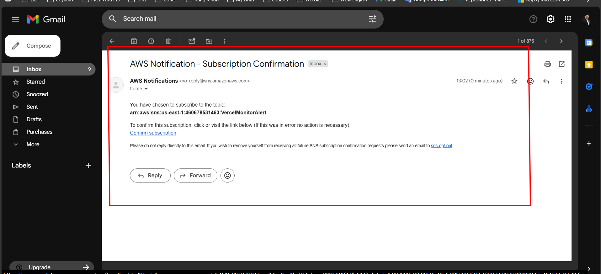
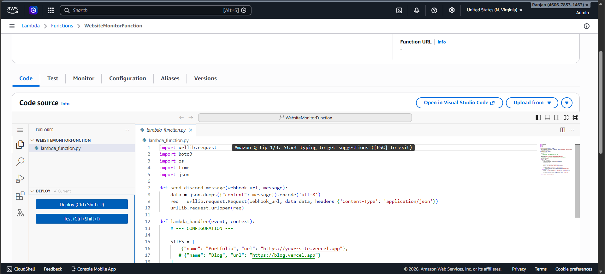
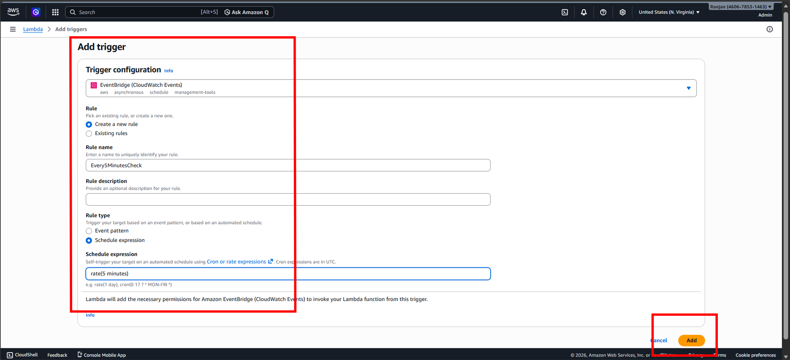

# 🚀 Serverless Website Uptime Monitor & Real-time Alerting System

## 🌐 Introduction
This is a professional, cloud-native uptime monitoring solution. It autonomously tracks the availability of websites and sends instant email notifications if a downtime occurs. Built using a serverless architecture, it ensures 24/7 reliability with zero server maintenance.

### 🌍 Real-World Use Cases
* **E-commerce Monitoring:** Ensure online stores never miss a sale due to undetected downtime.
* **Portfolio Protection:** Keep a constant eye on personal portfolios or client websites.
* **SaaS Health Checks:** Monitor API endpoints and service status for software applications.

---

## 🛠️ Step-by-Step Implementation Guide

### 1. Initial Environment & GitHub Access
The foundation starts with setting up the local development environment in VS Code and configuring GitHub secrets for secure AWS communication.

### 2. AWS SNS Configuration (Messaging Backbone)
Setting up the Simple Notification Service to handle email alerts.

### 3. AWS IAM Role & Permissions (Security)
Configuring Identity and Access Management (IAM) to ensure the Lambda function has exact permissions.

### 4. AWS Lambda & EventBridge Integration
Creating the serverless function and scheduling it to run every 5 minutes.

### 5. Deployment via GitHub Actions (CI/CD)
Pushing the code to GitHub and watching the automated deployment pipeline.

### 6. Rigorous Testing & Downtime Alerts
Verifying the system by simulating downtime.

### 7. Monitoring & Observability (CloudWatch)
Analyzing logs and metrics to ensure long-term health.

---

## 🔓 Open Source & Contributions
This is an **Open Source** project. Feel free to clone, fork, and enhance the code.

## 👨‍💻 Developed By
**Malinda Prabath**
* 📧 Email: [malindaprabath876@gmail.com](mailto:malindaprabath876@gmail.com)
* 💼 Cloud & DevOps Enthusiast