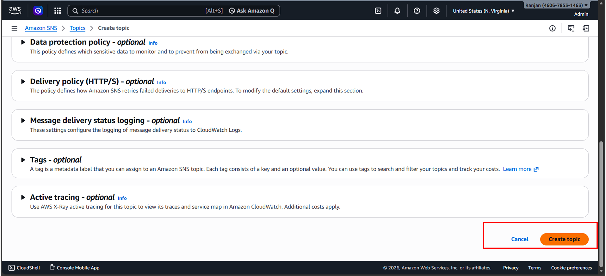

# 🚀 Serverless Website Uptime Monitor & Alerting System
**An automated monitoring solution using AWS Lambda, SNS, and GitHub Actions.**

## 📖 Project Introduction
This project is a cloud-native, serverless solution designed to monitor the availability of websites (like your portfolio). It checks the site status every 5 minutes and sends an instant email alert via AWS SNS if any downtime is detected.

---

## 🏗️ How it Works (Architecture)
1. **GitHub Actions:** Automatically deploys your code to AWS when you push to the `main` branch.
2. **AWS EventBridge:** Triggers the Lambda function every 5 minutes.
3. **AWS Lambda:** Runs the Python script to check if the website is "UP" (HTTP 200).
4. **AWS SNS:** Sends an email notification if the site is "DOWN".
5. **CloudWatch:** Records all logs and metrics for troubleshooting.

---

## 🛠️ Step-by-Step Setup Guide (For Cloners)

### Step 1: Local Environment Setup
1. Clone this repository to your local machine.
2. Open the project in **VS Code**.
3. Update the `SITES` list in `lambda_function.py` with your own website URLs.

### Step 2: Configure AWS SNS (Notifications)
1. Log in to your AWS Console and search for **SNS**.
2. Create a **Standard Topic** (e.g., `VercelMonitorAlert`).
3. Create a **Subscription**:
   - Protocol: `Email`
   - Endpoint: `Your Email Address`
4. **Important:** Go to your email inbox and click **"Confirm Subscription"** in the mail from AWS.

### Step 3: Configure AWS IAM (Permissions)
Create an IAM Role for your Lambda function with the following permissions:
1. `AWSLambdaBasicExecutionRole` (for CloudWatch logs).
2. A custom policy to allow `sns:Publish` to your SNS Topic ARN.

### Step 4: AWS Lambda & Trigger Setup
1. Create a Lambda function using **Python 3.x**.
2. Assign the IAM Role created in Step 3.
3. Add a **Trigger**: Select **EventBridge (CloudWatch Events)**.
4. Schedule expression: `rate(5 minutes)`.

### Step 5: CI/CD with GitHub Actions
To enable auto-deployment:
1. In your GitHub repo, go to **Settings > Secrets and variables > Actions**.
2. Add two secrets:
   - `AWS_ACCESS_KEY_ID`
   - `AWS_SECRET_ACCESS_KEY`
3. Push your changes to GitHub.

---

## 🔍 Verification & Testing
1. **Successful Run:** If the site is up, logs will show `Portfolio is UP`.
2. **Alert Simulation:** Change the URL to a wrong one. You will receive an email like the one below.
3. **Log Monitoring:** View detailed execution steps in CloudWatch.

---

## 🛠️ Troubleshooting
* **Permission Denied:** If CloudWatch logs are not appearing, check the IAM role policies.

* **High Latency:** Check the **Monitoring** tab in Lambda for performance metrics.

---

### 👨‍💻 Developed by
**[Your Name]** - [LinkedIn] | [Portfolio]